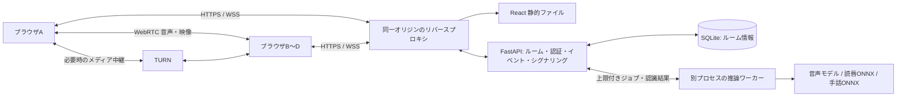
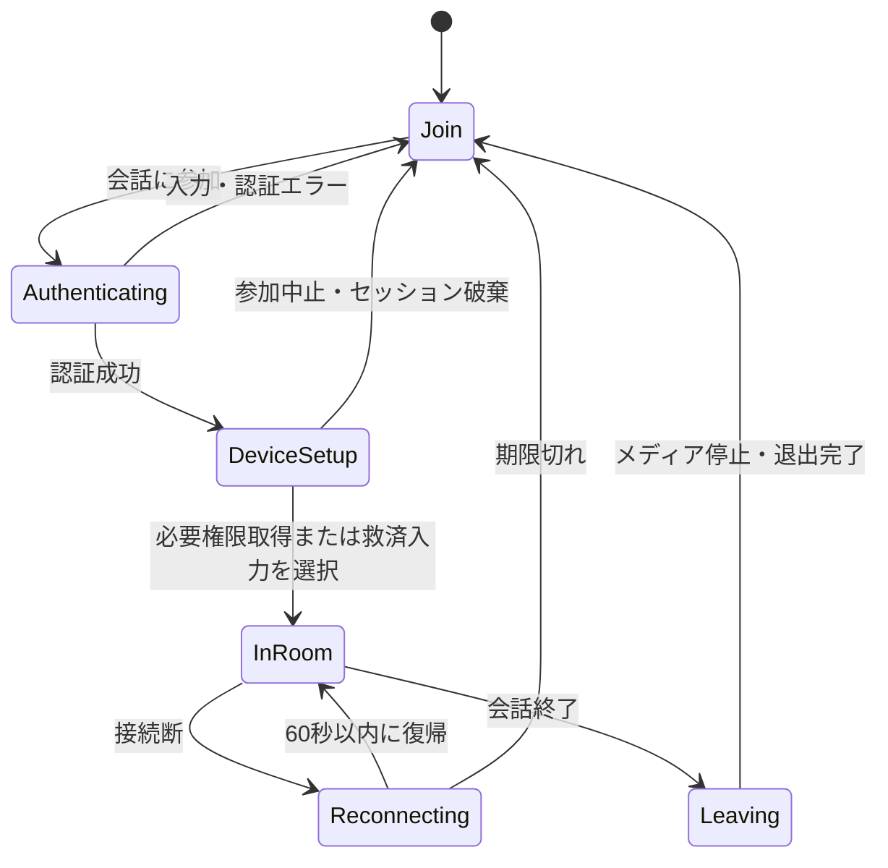

# 発声・読唇・手話対応 会話アプリ設計書

作成日: 2026-09-09

対象: `demo` の新規実装
状態: 実装前の設計。技術選定・設定値・性能目標は本書での提案であり、動作確認済みの値ではない。

## 1. 目的と設計の前提

発声、口の動き、手話を入力として利用し、参加者が自分に適した映像・音声・文字で会話できるWebアプリを作る。認識結果を共通の発言データへ変換することで、異なる入力方法の参加者が同じ会話に参加できるようにする。

### 1.1 参照レイアウト

| ファイル | 図にある要素 | 対応する実装画面 |
|---|---|---|
| [title.png](design/title.png) | アプリ名、説明、標準・視覚サポート・聴覚サポートの3カード、ID、Password、会話に参加 | モード選択・入室画面 |
| [talk.png](design/talk.png) | 上部の参加者カメラと入力アイコン、発話者映像、右側文字おこし、認識状態、補助読み上げ、下部操作 | 標準・聴覚サポート用会話画面 |
| [talk_vision_support.png](design/talk_vision_support.png) | 大きな発話者映像、マイク、カメラ、会話終了 | 視覚サポート用会話画面 |

図の配置・青い操作部・大きな映像領域を踏襲する。図から読み取れない挙動は以下の仕様で補う。

- `ID` は会話ルームID、`Password` はルーム参加用パスワードとする。個人アカウント認証は初期版に含めない。画面ラベルには「ルームID」を併記する。
- ルームは参加画面でID・パスワードを設定して作成でき、作成者は続けて入室する。相手は同じID・パスワードで既存ルームへ参加する。運営者用CLIも利用可能。参加者名は「ユーザーA」などをサーバーが割り当て、同一ルーム内で重複させない。
- 標準モードの「発声・読唇」は選択可能な入力方式を表し、初期版ではどちらか一方を明示選択する。同時認識による自動融合は行わない。
- `talk.png` の出力横にある口の絵は意味が曖昧なため、実装では「音声」「文字」を明記する。口の絵を読唇アニメーションの出力機能とは解釈しない。
- 聴覚サポート専用の会話図はないため、`talk.png` を共用し、手話入力・文字出力を初期値とする。
- 「会話終了」は操作した本人の退出を意味する。全員の会話を終了させる操作は設けない。

### 1.2 対応範囲

| 項目 | 初期版で実装する内容 | 拡張時の内容 |
|---|---|---|
| 参加人数 | 1ルーム最大4人。複数端末から参加 | SFU導入後の人数拡張 |
| 言語 | 日本語の発声、日本語の登録読唇フレーズ、日本手話の登録表現 | 多言語、連続読唇・連続手話翻訳 |
| 発声 | マイク音声を日本語の自由文へ文字起こし | 音声と映像の認識結果の融合 |
| 読唇 | 学習済みの限定フレーズを無音映像から識別し、本人が確認して送信 | 日本語の自由発話に対応するモデルの評価・導入 |
| 手話 | 学習済みの限定単語・定型表現を時系列から識別し、本人が確認して送信 | 文法・非手指表現を含む連続手話翻訳 |
| 出力 | 相手の映像、生音声、字幕、確定テキストの補助読み上げ | 手話映像生成など |
| 保存 | ルーム認証情報だけ永続化。会話履歴はルーム稼働中のメモリ内 | 利用者が明示選択する履歴保存・出力 |

読唇・手話は、特徴点検出ライブラリを入れるだけでは文章認識できない。独自の語彙定義、学習データ、認識用重みを用意することが実装成立の条件となる。初期デモはそれぞれ10〜20クラス程度を目安にし、評価を通過した語彙だけを公開する。これらは一般的な読唇・手話通訳の完成を意味しない。利用可能な表現を入室前と認識パネルに表示する。

## 2. 全体構成と技術選定



| 層 | 採用案 | 責務 |
|---|---|---|
| フロントエンド | React、TypeScript、Vite | 3画面、状態管理、デバイス操作、字幕、読み上げ |
| 通話 | WebRTCのmesh接続 | 最大4人で相互に映像・音声を配送 |
| ブラウザ内前処理 | MediaPipe Tasks Vision、Web Worker、AudioWorklet | 顔・手・姿勢の特徴点、音声の整形 |
| API | Python 3.11を基準候補としたFastAPI、Uvicorn、Pydantic | REST、WebSocket、認証、入力検証 |
| 推論 | faster-whisper、ONNX Runtime | 音声認識、独自読唇・手話モデルの実行 |
| 学習 | PyTorch | 時系列分類器の学習・ONNX出力 |
| 永続化 | SQLite | ルームID、パスワードハッシュ、有効期限 |
| 配信 | Caddy等のリバースプロキシ、coturn | HTTPS/WSS、静的配信、NAT越えの中継 |

WebRTCのシグナリングはアプリ側で実装する。STUNで接続できないネットワークではTURNを使う。[WebRTC公式: Peer connections](https://webrtc.org/getting-started/peer-connections)

通話用映像はWebRTCで参加者間に流し、AIサーバーへは選択中の認識に必要なPCM音声または特徴点を別途送る。相手の映像を再認識せず、各参加者が自分の入力だけを送信する。送信者と話者が対応するため、初期版では話者分離モデルを使わない。

依存バージョンは実装時にCPU/GPUとブラウザの組合せを検証し、`package-lock.json` と `uv.lock` で固定する。モデル・WASMも固定版を自前配信し、実行時のCDN最新版参照を避ける。

## 3. ディレクトリ構造

以下は完成時の構造案。現在の入力資料は `design/` 内の3枚であり、本書作成によってアプリ本体や学習済み重みが生成されるわけではない。

```text
demo/
├── design/                         # 参照画像を保持
│   ├── title.png
│   ├── talk.png
│   └── talk_vision_support.png
├── design.md
├── README.md                       # セットアップ・デモ・対応語彙
├── .env.example                    # 秘密値の変数名と非秘密の例
├── .gitignore                      # .env、DB、収録データ、大きな重みを除外
├── config/
│   ├── app.yaml                    # 共通設定とモード初期値
│   ├── app.local.yaml              # 任意のローカル上書き。Git管理外
│   └── vocabulary.ja.json          # クラスIDと表示文・対応方式
├── frontend/
│   ├── package.json
│   ├── package-lock.json
│   ├── vite.config.ts
│   ├── tsconfig.json
│   ├── index.html
│   ├── public/models/mediapipe/    # .taskモデル、WASM、ライセンス
│   └── src/
│       ├── main.tsx
│       ├── App.tsx
│       ├── pages/
│       │   ├── JoinPage.tsx
│       │   ├── TalkPage.tsx
│       │   └── VisionSupportPage.tsx
│       ├── components/
│       │   ├── ModeCard.tsx
│       │   ├── ParticipantStrip.tsx
│       │   ├── SpeakerStage.tsx
│       │   ├── TranscriptPanel.tsx
│       │   ├── RecognitionStatus.tsx
│       │   ├── RecognitionComposer.tsx  # 開始・終了・候補確認・文字入力
│       │   └── ConversationControls.tsx
│       ├── hooks/                 # useDevices / usePeers / useSpeechOutput
│       ├── services/              # api / controlSocket / mediaSocket
│       ├── workers/vision.worker.ts
│       ├── worklets/pcm-processor.ts
│       ├── stores/sessionStore.ts # ルーム・参加者・字幕・UI状態
│       ├── types/protocol.ts
│       └── styles/                # tokens.css、layout.css、accessibility.css
├── backend/
│   ├── pyproject.toml
│   ├── uv.lock
│   ├── app/
│   │   ├── main.py
│   │   ├── core/                  # config / security / logging
│   │   ├── api/                   # config / sessions / health
│   │   ├── ws/                    # control / media / signaling
│   │   ├── schemas/               # イベント、REST、特徴量の型
│   │   ├── services/              # rooms / transcripts / inference_queue
│   │   ├── models/                # Room、Session、Participant、Utterance
│   │   ├── repositories/          # SQLiteとメモリ内ストア
│   │   └── inference/
│   │       ├── base.py            # 共通Recognizerインターフェース
│   │       ├── worker.py          # 起動時ロード、期限、実行プロセス
│   │       ├── speech.py
│   │       ├── lipread.py
│   │       ├── sign.py
│   │       └── preprocessing.py
│   └── tests/                     # API・認証・状態遷移・推論契約テスト
├── models/
│   ├── manifest.json              # 全アセットの取得元、版、SHA-256
│   ├── speech/whisper-small/       # 多言語版のローカル重み・tokenizer
│   ├── lipread/                    # model.onnx、labels.json、metadata.json
│   └── sign/                       # model.onnx、labels.json、metadata.json
├── training/
│   ├── extract_features.py
│   ├── train_temporal.py
│   ├── export_onnx.py
│   ├── evaluate.py
│   └── dataset_manifest.example.json
├── scripts/
│   ├── prepare_models.py          # 指定revision取得・ハッシュ確認
│   ├── create_room.py             # パスワードは非表示の対話入力
│   └── check_capabilities.py      # デモ前のモデル・機器・性能確認
├── deploy/
│   ├── compose.yaml
│   ├── Dockerfile.backend
│   ├── Dockerfile.frontend
│   ├── Caddyfile
│   └── turnserver.conf.template
├── tests/e2e/                     # 複数参加者、権限拒否、支援操作
└── data/                          # Git管理外
    ├── rooms.sqlite3
    └── training/                  # 同意を得た学習素材のみ。会話録画と別管理
```

## 4. config内容

### 4.1 読み込みと検証

読み込み優先順位は `app.yaml` → `app.local.yaml` → 環境変数。辞書は再帰的に上書きし、配列は置換する。相対パスは作業ディレクトリではなく `demo/` を基準に解決する。Pydanticで起動時に型・範囲・未知キーを検証し、秘密値をログに出さない。

一般設定の環境変数は `APP__SERVER__PORT` のように `APP__` と `__` 区切りを使用する。以下の `.env` の専用名はSecretSettingsで明示的に対応付ける。設定中の `enabled: true` は有効化の要求であり、実際の利用可否はモデル検証・ウォームアップ後に決定する。

### 4.2 `config/app.yaml` の初期案

```yaml
app:
  name: "ことばリンク"            # 仮称。title.pngの「アプリ名」に表示
  locale: ja-JP
  environment: development

server:
  host: 127.0.0.1
  port: 8000
  workers: 1                      # ルーム状態がプロセスメモリにあるため固定
  allowed_origins: ["http://localhost:5173", "http://127.0.0.1:5173"]
  websocket_max_message_bytes: 65536
  heartbeat_seconds: 15
  disconnect_timeout_seconds: 45

room:
  max_participants: 4
  creation_ttl_seconds: 86400     # 画面から作成したルームは24時間有効
  session_ttl_seconds: 7200
  reconnect_grace_seconds: 60
  event_replay_seconds: 60
  max_transcript_entries: 500
  empty_room_cleanup_seconds: 60
  max_text_chars: 500

security:
  cookie_name: conversation_session
  cookie_secure: false            # ローカルHTTPのみ。配信時は必ずtrue
  cookie_samesite: strict
  join_attempts_per_minute: 5
  join_failure_message: "ルームIDまたはパスワードを確認してください"

media:
  video_width: 1280
  video_height: 720
  video_fps: 30
  audio_sample_rate: 16000        # AI送信用。機器側の実サンプルレートとは別
  audio_channels: 1
  audio_chunk_ms: 200
  echo_cancellation: true
  noise_suppression: true
  vision_fps: 20
  feature_batch_frames: 5
  camera_off_stops_capture: true

rtc:
  topology: mesh
  ice_transport_policy: all
  stun_urls: []                   # 配信時に管理するSTUNのURLを設定
  turn_enabled: false            # 端末間の本番デモではtrueにする
  turn_credential_ttl_seconds: 600

recognition:
  language: ja
  max_pending_jobs_per_participant: 2
  max_pending_jobs_total: 8
  worker_processes: 1
  job_timeout_seconds: 10
  partial_results: false          # 初期版は区間終了後の確定候補のみ
  speech:
    enabled: true
    provider: faster_whisper
    model_path: models/speech/whisper-small
    device: cpu
    compute_type: int8
    beam_size: 1
    vad_silence_ms: 600
    min_segment_ms: 300
    max_segment_ms: 10000
  lipread:
    enabled: true
    provider: onnx_temporal_classifier
    model_path: models/lipread/model.onnx
    metadata_path: models/lipread/metadata.json
    feature_schema: lip40_v1
    max_frames: 64
    min_valid_frame_ratio: 0.8
    candidate_threshold: 0.80
    top_k: 3
    require_confirmation: true
  sign:
    enabled: true
    provider: onnx_temporal_classifier
    model_path: models/sign/model.onnx
    metadata_path: models/sign/metadata.json
    feature_schema: sign100_v1
    max_frames: 96
    min_valid_frame_ratio: 0.8
    candidate_threshold: 0.85
    top_k: 3
    require_confirmation: true

output:
  tts_provider: browser_speech_synthesis
  tts_lang: ja-JP
  tts_rate: 1.0
  tts_queue_limit: 10
  tts_skip_own_utterances: true
  tts_skip_replayed_events: true
  speak_participant_changes_in_vision_mode: true

modes:
  standard:
    input: speech
    allowed_inputs: [speech, lipread, text]
    output: [audio, text]
    camera_on: true
    microphone_on: true
    layout: talk
  vision_support:
    input: speech
    allowed_inputs: [speech, text]
    output: [audio]
    camera_on: true
    microphone_on: true
    layout: vision_support
  hearing_support:
    input: sign
    allowed_inputs: [sign, text]
    output: [text]
    camera_on: true
    microphone_on: false
    layout: talk

storage:
  room_database: data/rooms.sqlite3
  persist_transcripts: false
  persist_media: false

observability:
  log_level: INFO
  log_transcript_text: false
  metrics_enabled: true
```

各モードの初期値はブラウザ権限が得られた場合に適用する。「text」は図に追加する救済入力で、通常は認識結果確認パネルから開く。ルーム内の他者の出力設定には影響しない。

候補の閾値は暫定値。softmax値をそのまま正答率と表示せず、検証データで調整する。GPUを採用する場合は `speech.device: cuda`、対応する `compute_type`、ONNXの実行プロバイダーを検証済みの組合せに変更する。CPU構成で4人同時認識が目標に達しなければ、デモ運用を順番発話にするかGPU構成を用意する。

### 4.3 `.env.example` と秘密値

```dotenv
APP_CONFIG=config/app.yaml
APP_ENV=development
APP_PUBLIC_ORIGIN=http://localhost:5173
APP_SESSION_SECRET=replace-with-random-secret-at-least-32-bytes
APP_TURN_SHARED_SECRET=replace-for-deployed-turn
APP_TURN_URLS=turn:turn.example.invalid:3478?transport=udp,turns:turn.example.invalid:5349?transport=tcp
```

`APP_SESSION_SECRET` はセッション識別子のHMACダイジェスト生成に使い、サーバーにはそのダイジェストを保存する。ブラウザにはランダムな不透明トークンだけをHttpOnly Cookieで渡す。`APP_TURN_SHARED_SECRET` は短期TURN資格情報の生成用で、ブラウザへ返さない。ルームパスワードは設定ファイルに書かず、作成画面またはCLIで受け付けハッシュ化する。

配信環境では `APP_ENV=production`、`APP_PUBLIC_ORIGIN=https://実際のホスト名`、`APP__SECURITY__COOKIE_SECURE=true`、許可オリジン、STUN/TURNを設定する。productionで例示秘密値、HTTP、Secure無効を検出したら起動失敗とする。フロントエンドの `VITE_*` には秘密値を置かず、APIは同一オリジンの相対URLを使う。

### 4.4 公開設定と語彙

`GET /api/config` はアプリ名、モード、UI制限、モデルごとの `available`・`reason`・対応語彙版を返す。パス、秘密値、DB接続情報を返さない。ICEサーバーと短期資格情報は入室認証後の `GET /api/rtc-config` から取得する。

`vocabulary.ja.json` は次の形式とし、`labels.json` のクラスIDと一致させる。下記は形式例であり、学習済み語彙の存在を示すものではない。

```json
{
  "version": "demo-ja-v1",
  "items": [
    {"id": "greeting", "text": "こんにちは", "modalities": ["lipread", "sign"]},
    {"id": "thanks", "text": "ありがとう", "modalities": ["lipread", "sign"]},
    {"id": "repeat", "text": "もう一度お願いします", "modalities": ["sign"]}
  ]
}
```

## 5. 画面設計

### 5.1 共通スタイル

参照画像はすべて1600×900。固定キャンバスではなくCSS Grid/Flexで比率を再現する。白背景、青系ボタン、濃紺の枠、角丸を共通化する。青は図に近い `#4472C4` を基準とし、文字と背景のコントラストを実測して調整する。

本文は原則20px以上、操作ボタンは24px以上、視覚サポートの主要操作は32px以上。クリック領域は最小48×48px、視覚サポートでは高さ96px以上。状態は色だけで示さず「マイク ON」などの文字とアイコンを併記する。動画は顔・手が切れない `object-fit: contain` を基本とする。

幅1200px以上では図と同じ横配置。768〜1199pxでは字幕幅を約30%とし、下部操作を折り返す。767px以下では映像→状態→字幕→操作の縦配置にする。操作バーが字幕末尾やソフトウェアキーボードと重ならない余白を設ける。

### 5.2 モード選択・入室画面 `/`

| 領域 | 表示・仕様 |
|---|---|
| 上部中央 | 仮称「ことばリンク」、説明「発声・読唇・手話に対応可能な会話アプリ」 |
| 中央3カード | 左から標準、視覚サポート、聴覚サポート。入力・出力の見出しとアイコン・文字 |
| モード選択 | ラジオグループとして単一選択。標準を初期選択。選択枠とチェックで状態表示 |
| 標準カード | 入力「発声／読唇」、出力「音声・文字」。カード内または直下で入力を選べる |
| 視覚サポートカード | 入力「発声」、出力「音声」。選択状態をスクリーンリーダーへ通知 |
| 聴覚サポートカード | 入力「手話」、出力「文字」。対応表現一覧への導線 |
| 下部フォーム | ルームID、パスワード。関連付けたlabel、パスワード表示切替 |
| 最下部中央 | 「会話に参加」。送信中は「接続中」にし、多重送信防止 |
| 補足領域 | 選択入力の制約、認識処理への音声／特徴点送信の説明、エラー |

IDは3〜32文字の半角英数字・ハイフンで、前後空白を除いて小文字へ正規化する。パスワードは前後空白を勝手に除去しない。未入力は該当項目へフォーカスし、認証失敗はIDの存在を区別しない文言にする。

### 5.3 標準・聴覚サポート会話画面 `/rooms/:roomId`

| 領域 | 図への対応と実装仕様 |
|---|---|
| 左上の参加者列 | 最大4人のサムネイル、表示名、発声／読唇／手話／文字のバッジ、マイク・カメラ状態 |
| 左中央の映像 | 現在の発話者。選択した参加者の映像を固定表示できる |
| 右側約24% | 「文字おこし」。時刻、話者、入力種別、本文、修正済みマーク |
| 映像直下1段目 | 「ユーザーA：音声を認識しています」など入力方式に合った状態 |
| 映像直下2段目 | 「補助読み上げ：…」。文字のみの場合は「補助読み上げ OFF」 |
| 下部左 | マイクON/OFF、カメラON/OFF、入力方式、出力方式 |
| 下部右 | 参加者数ボタン、会話終了ボタン |
| 認識時の補助パネル | 読唇・手話の開始／終了、撮影ガイド、候補確認、修正・送信。状態欄から展開 |

認識用パネルは図にない追加要素だが、誤認識した文が自動送信されることを防ぐため必要となる。聴覚サポートでは初期展開し、手と上半身が映る自分のプレビューを確保する。読唇では口元と照明のガイドを出す。どちらも自分の映像を確認でき、中央が相手映像でも操作可能にする。

字幕は確定発言のみ共有し、未確定候補は本人だけに表示する。自動スクロール中に過去ログを読んだら追従を止め、「最新へ」で復帰する。入力アイコンは画像だけに依存せず、代替テキストを付ける。

発話者は、サーバーが受けた発声活動または読唇・手話の区間開始をもとに選ぶ。現在の発話者が活動中なら維持し、終了後に待機中の最も早い開始を選ぶ。同時発話は全員認識するが中央映像は1人だけとする。最低2秒の表示維持で頻繁な切替を抑え、固定表示中は自動切替を止める。

### 5.4 視覚サポート画面 `/rooms/:roomId?layout=vision`

`talk_vision_support.png` に沿い、上部の大半を発話者映像、下部左にマイク・カメラ、下部右に会話終了を配置する。通常時には字幕列、参加者サムネイル、細かい認識操作を表示しない。

視覚サポートは低視力だけを想定せず、映像を見なくても入室・会話・退出ができる設計にする。各ボタンに現在状態を含む読み上げ名を付け、入退室・認識停止・通信断を音声通知する。重要状態はDOM上の `role="status"` にも保持する。アプリ音声通知とスクリーンリーダーの二重読みを避けるため「通知をアプリ音声／スクリーンリーダー」の設定を用意する。

図の主操作3個は維持し、読み上げ停止、出力音声、文字入力による救済、標準画面への切替は、キーボードフォーカスで現れる補助メニューから利用できるようにする。フォーカスされた操作を見えないままにしない。

### 5.5 アクセシビリティ

- Tabで移動、Enter/Spaceで決定できる。トグルは `aria-pressed`、モードはradioとして実装する。
- フォーカス枠を常時識別可能にし、画面遷移後は見出し、エラー時はエラー要約へ移す。
- 会話終了ボタンは他ボタンと十分に離す。確認ダイアログは設けず、退出後に同じルームへの再参加導線を出す。
- 字幕の拡大、ブラウザ200%ズーム、動きを減らす設定で操作要素が欠けないことを確認する。
- ショートカットは任意で `Alt+M` マイク、`Alt+C` カメラ、`Alt+S` 読み上げ停止、`Alt+R` 認識区間開始／終了。入力欄編集中は発火させず、ブラウザ等と競合する場合は無効化・変更可能にする。

## 6. 画面操作設計

### 6.1 状態と画面遷移



認識は別の状態として `idle → capturing → processing → reviewing → submitted` を持つ。発声では `reviewing` を省略し、自動確定する。入力方式変更、カメラ／マイクOFF、退出時は進行中区間を `cancelled` にし、古い結果を共有しない。

### 6.2 入室手順

1. `/api/config` を取得し、利用可能な入力方式を表示する。未導入の方式は理由を示し、文字入力等を選べるようにする。
2. 「新規ルームを作成」または「既存ルームに参加」を選び、モード・入力、ルームID、パスワードを設定する。新規作成は `POST /api/rooms` の成功後に同じ資格情報で入室する。IDは半角英数字・ハイフンの3〜32文字、作成時パスワードは8〜128文字。同一IDの作成は409で拒否し、上書きしない。既存ルームは「会話に参加」を押す。作成成功後に入室が失敗した場合は作成済みと表示し、入室だけを再試行する。
3. `POST /api/rooms/{room_id}/join` で認証し、セッションCookieと本人IDを受け取る。この時点では参加枠の予約とし、接続未完了の枠は60秒で解放する。
4. 必要なマイク・カメラの権限を要求する。発声はマイク、読唇・手話はカメラが必須。発声でのカメラは任意。
5. プレビューと音声再生の状態を確認し「会話を開始」を押す。この操作でAudioContextの再開・音声出力の開始を試み、再生拒否時には再試行ボタンを出す。
6. 制御用・認識用WebSocketを接続し、ルーム状態とICE設定を取得してWebRTC接続を確立する。

カメラ／マイクの利用には許可と安全なコンテキストが必要になる。ローカル開発はlocalhost、他端末からのアクセスはHTTPSを使用する。[MDN: getUserMedia](https://developer.mozilla.org/en-US/docs/Web/API/MediaDevices/getUserMedia)

### 6.3 会話中の操作

| 操作 | クライアント処理 | サーバー・他参加者への反映 |
|---|---|---|
| マイクOFF | 音声送出・AudioWorklet送信を止め、trackを停止。発声区間を破棄 | `device.update` と区間取消。処理中の旧結果を無効化 |
| マイクON | 権限を確認し再取得、音声trackを交換 | 状態更新後に発声入力を再開 |
| カメラOFF | 映像trackを停止、特徴点抽出停止、送信停止 | `device.update`。読唇・手話は「カメラOFFのため停止」 |
| カメラON | 再取得し `replaceTrack` 等で接続へ反映 | 映像復帰を通知。読唇・手話は新規区間から再開 |
| 発声→読唇 | 現区間取消、入力世代更新、マイクOFF、カメラ確認 | `input.update` の応答後、新入力だけ受理 |
| 読唇→発声 | 現区間取消、入力世代更新、マイク許可確認 | 切替完了後、新しい音声区間を受理 |
| 出力切替 | 「音声＋文字」「文字」「音声」を選ぶ。受信再生と字幕表示を更新 | 本人の設定だけ変更。送信デバイスは変更しない |
| 読唇・手話の開始 | 開始ボタンから区間を作り、特徴点収集。カウントダウン表示 | `segment.start` でID・方式を検証 |
| 読唇・手話の終了 | 終了ボタンまたは時間上限で収集停止 | `segment.end` 後に分類し、本人へ候補を返す |
| 候補確認 | 候補選択、文字修正、「送信」。不明時は再試行 | `utterance.submit` の認証後、確定字幕を全員へ配信 |
| 字幕修正 | 自分の発言だけ編集可能 | `utterance.correct` でrevisionを更新し、全員の同一行を差替え |
| サムネイル選択 | その参加者を固定。再選択または「自動」で解除 | ローカル表示のみ |
| 参加者数 | 名前、方式、接続・デバイス状態の一覧を表示 | サーバーの参加者一覧を参照 |
| 会話終了 | 全track、Worker、WebSocket、PeerConnection、TTSを停止 | 退出APIでセッション無効化・他者へ退出通知 |

読唇・手話入力では初期マイクOFFとし、マイク操作は「この入力方式ではマイクを使用しません」と説明して無効にする。発声入力へ切り替えたときだけマイクONを許可する。図のマイクボタンの位置は維持する。

### 6.4 出力ルーティングと二重読み上げ防止

共通の発言には `source: speech | lipread | sign | text` を持たせる。

| 相手の発言 | 文字出力 | 音声出力 |
|---|---|---|
| 発声 | 音声認識後の確定字幕 | WebRTCの生音声。通常は同じ字幕をTTSで再生しない |
| 読唇・手話・文字 | 本人が送信した確定文 | 受信側端末でTTS。「ユーザーA、こんにちは」等 |
| 修正 | 元の行を更新し「修正済み」表示 | 読み上げ済みなら「訂正」と修正文を1回だけ再生 |

音声出力OFFは相手音声の再生停止とTTS停止を意味する。自分のマイクOFFとは独立する。文字出力OFFでも字幕データはメモリで保持し、再表示できる。自分の確定発言は標準で読み上げない。

TTSは受信側だけで実行し、生成音声をWebRTCへ混ぜない。発声中はTTSを待機させ、キュー上限を超えたら通知と「未読を再生」操作を提示する。エコーキャンセルとヘッドセットで回り込みを抑え、同じ文が再送され続けないことを実機確認する。

### 6.5 異常時の挙動

| 条件 | 表示・操作 |
|---|---|
| 認証失敗／満員 | 入室画面で理由を表示し、モードとIDは維持。パスワードはログ・URL・ストレージに保存しない |
| 権限拒否／機器なし | 必要な権限だけ再試行。発声・読唇・手話の別方式、または文字入力／受信のみを選択 |
| 顔・手が見えない | 本人へ撮影位置の案内。欠損データを正解候補として自動送信しない |
| 認識対象外／低スコア | 「認識できませんでした」。再試行・登録表現一覧・文字入力 |
| モデル欠落／推論停止 | 該当入力だけ利用不可。他の方式と通話は継続 |
| WebRTCのみ接続失敗 | ICE再接続。字幕接続が生きていれば字幕会話を継続 |
| 制御接続断 | 「再接続中」。新しい発言送信と認識を停止。通話が生きている場合も状態を明示 |
| TTS利用不可 | 「音声を開始」操作、日本語音声の選択、文字表示への切替を提示 |
| サーバー再起動 | メモリ履歴とセッションは復元しない。再入室を案内 |

視覚サポートで利用可能な日本語音声がない場合、音声出力を前提にしたモード開始は保留し、音声の設定またはスクリーンリーダー対応の文字表示へ切り替える。無音のまま正常参加と表示しない。

## 7. サーバー設計

### 7.1 プロセスと責務

APIプロセスは認証、参加者状態、WebSocket、シグナリング、結果配送を担当する。FastAPIのWebSocketで双方向イベントを扱う。[FastAPI公式: WebSockets](https://fastapi.tiangolo.com/advanced/websockets/)

推論は別プロセスで実行し、APIのイベントループを塞がない。初期版は単一推論ワーカーがモデルを起動時にロードし、参加者ごとの公平な順番でジョブを処理する。未開始ジョブは参加者2件、全体8件までとし、上限時は `recognition.busy` を返す。音声の欠損や区間の破棄を無通知にしない。

音声のVAD・区間バッファは参加者別に管理し、最大10秒で区切る。特徴点バッファも区間上限で打ち切る。期限切れジョブの結果は破棄する。実行中処理が停止不能な場合はワーカープロセスを再生成し、影響を受けたジョブへ失敗通知を返す。

Uvicornは1 workerで動かす。単純にworker数を増やすとルーム状態が分離するため、拡張時はRedis等にセッション・ルーム・イベントを外出しし、Pub/Sub等で配送する。参加人数を増やすときはmeshの接続本数増加を踏まえ、SFUへの置換も必要になる。

### 7.2 REST API

| メソッド・パス | 入力 | 応答／認可 |
|---|---|---|
| `GET /api/config` | なし | 公開設定、実際の機能可否。未認証可 |
| `POST /api/rooms` | `room_id, password` | 未認証で作成可能。Origin・IP単位の作成回数制限。`201` と `room_id, expires_at, max_participants`。既存IDは`409` |
| `POST /api/rooms/{room_id}/join` | `password, mode, input` | `participant_id, display_name, room_id, expires_at` とCookie |
| `GET /api/session` | Cookie | 現セッション、参加者、モード、入力世代 |
| `DELETE /api/session` | Cookie、CSRFトークン | `204`。本人退出とCookie失効。再実行も安全 |
| `GET /api/rooms/{room_id}/snapshot` | Cookie | 参加者、最大500件の確定字幕、`last_server_seq` |
| `GET /api/rtc-config` | Cookie | ICE URL、期限付きTURN資格情報、有効期限 |
| `GET /health/live` | なし | APIプロセスの生存 |
| `GET /health/ready` | なし | DB・配送の準備状態、入力方式ごとのモデル準備状態 |

認証済みAPIはCookieに紐づくルームだけ許可する。作成とjoin時はOriginを確認する。作成はIDによらずIP単位、joinはIPとルームIDの組合せで試行回数を制限する。上限には `security.join_attempts_per_minute` を使用する。セッションの状態更新RESTはセッション発行時に返したCSRFトークンをヘッダーで検証する。パスワードはArgon2idのsalt付きハッシュのみDBに保存する。

CookieはHttpOnly、配信時Secure、SameSite=Strict、Path=/とする。WebSocketはCookieに加えてOriginを許可リストと照合する。接続時・イベント時ともセッション期限とルーム所属を検証し、クライアント指定の話者IDを信用しない。

### 7.3 WebSocketイベント

制御用は `/ws/rooms/{room_id}`、認識データ用は `/ws/rooms/{room_id}/media`。制御はJSON、認識データはバイナリで分離し、大きい認識入力が字幕やシグナリングを滞留させない構成にする。

```json
{
  "version": 1,
  "type": "utterance.final",
  "event_id": "server-generated-uuid",
  "server_seq": 42,
  "room_id": "demo-room",
  "participant_id": "server-derived-participant-id",
  "sent_at": "2026-09-09T08:00:00.000Z",
  "payload": {
    "utterance_id": "utterance-uuid",
    "revision": 1,
    "source": "sign",
    "text": "こんにちは",
    "confirmed_by_user": true,
    "model_version": "sign-demo-v1",
    "replayed": false
  }
}
```

上記はサーバー配信形式。クライアント送信は `version, type, request_id, payload` とし、サーバーが送信者・ルーム・時刻を付ける。文字数上限は500、制御メッセージは16KiB以下、特徴点等を含むメディアメッセージは64KiB以下とする。

| 方向 | type | 用途 |
|---|---|---|
| C→S | `session.resume` | 最終受信seqと入力状態を送信して再接続 |
| S→C | `room.snapshot`, `participant.joined/left/updated` | ルーム・参加者同期 |
| C→S | `device.update`, `input.update`, `preferences.update` | 操作反映。`input.update` は新しい入力世代を応答 |
| C↔S | `rtc.offer`, `rtc.answer`, `rtc.ice` | 同一ルームの宛先IDへシグナリング転送 |
| C→S | `segment.start`, `segment.end`, `segment.cancel` | 読唇・手話の区間境界。音声区間はサーバーVADが管理 |
| S→C | `recognition.state`, `recognition.candidate`, `recognition.busy` | 進行状態・本人専用候補・混雑 |
| C→S | `utterance.submit`, `utterance.correct` | 候補または手入力の共有、自分の発言修正 |
| S→C | `utterance.final`, `utterance.corrected`, `speaker.changed` | 共有字幕・映像の切替対象 |
| C↔S | `ping`, `pong` | 15秒間隔のアプリ層heartbeat |
| S→C | `ack`, `error` | request_idに対する結果。再試行可否を含む |

クライアントは `request_id` を再送時にも維持する。サーバーは60秒間の処理済みIDを保持して二重送信を防ぐ。発言更新は `utterance_id + revision`、UIとTTSは `event_id` で重複除外する。

### 7.4 メディア転送契約

1メッセージを「先頭4バイトのヘッダー長（uint32 little-endian）＋UTF-8 JSONヘッダー＋バイナリ本体」とする。ヘッダーは最大2048バイト。本文サイズ、配列形状、有限数、サンプル数を検証してから利用する。

ヘッダー共通項目は `version, kind, stream_id, input_epoch, seq, capture_ms`。`capture_ms` は端末の単調増加時刻で、UTC表示には使わない。`stream_id` は `input.update` 応答でサーバーが発行する。認識区間には追加で `segment_id` を含める。

| kind | 本体 | 検証と処理 |
|---|---|---|
| `audio.pcm` | 16kHz、mono、signed PCM16 little-endian、200ms＝3200samples＝6400bytes | AudioWorkletで実サンプルレートからリサンプル。サーバーでfloat32へ変換 |
| `vision.features` | float32 little-endian、最大5フレームの `[N,K,4]` | `schema, shape, frame_timestamps_ms` をヘッダーに追加。Kは読唇40、手話100 |

各特徴点の4要素は `x,y,z,valid`。正規化方法、座標系、特徴点順はモデルmetadataと一致させる。MediaRecorderのWebM断片をPCMとして扱わない。音声と特徴点を別々の方式として受理し、選択外の入力は拒否する。

`seq` はstreamごとの連番。制御とメディアは別接続なので、区間終了には `last_media_seq` を指定し、サーバーは到着済みデータとの一致を確認してから推論する。欠番の待機は最大1秒とし、未到着なら区間失敗を返す。古い `input_epoch`、重複seq、完了済み区間の入力は破棄する。

クライアントは送信待ちが1秒分を超えたら入力を一時停止し、混雑を通知する。古い音声を切れ目なく繋いで別の発言として認識させず、該当区間をキャンセルして新規区間から再開する。

### 7.5 データ設計と保持

| エンティティ | 主なフィールド | 保持先・期間 |
|---|---|---|
| Room | `id, password_hash, max_participants, expires_at, created_at` | SQLite。期限切れは運営CLIで削除 |
| Session | `token_digest, participant_id, room_id, csrf_digest, expires_at` | メモリ。退出・2時間の有効期限・再接続期限で破棄 |
| Participant | `id, display_name, mode, input, input_epoch, devices, connection_state` | メモリ。ルーム参加中と再接続猶予のみ |
| Utterance | `id, participant_id, source, text, revision, model_version, confirmed_by_user, created_at` | メモリ。最大500件、全員退出60秒後に破棄 |
| RecognitionCandidate | `id, participant_id, segment_id, candidates, expires_at` | 本人専用メモリ。送信・取消・60秒で破棄 |
| ReplayEvent | `event_id, server_seq, payload, created_at` | ルーム別60秒のリングバッファ |

音声・特徴点は推論終了または区間取消時に解放し、ログ・DB・ファイルに保存しない。カメラ映像はAIサーバーへ送らず、録画機能も設けない。学習用収録は日常会話と独立した工程で明示同意のあるデータだけを扱う。

### 7.6 再接続とWebRTC

再接続は1、2、4、8秒、その後最大10秒の間隔にjitterを加え、60秒まで試行する。Cookieが有効なら同じ参加者IDを再利用する。`last_server_seq` 以降のイベントが残っていれば再配送し、なければsnapshotで置き換える。snapshot・再配送字幕は過去分として扱い、読み上げない。

meshは4人で最大6組のPeerConnection、各参加者は最大3接続になる。参加者ID順で初回offer担当を決め、同時再ネゴシエーションの衝突も処理する。カメラ・マイクの再取得は既存senderの `replaceTrack` を優先し、必要な場合だけ再ネゴシエーションする。

STUN/TURNの資格情報は期限前に更新する。UDP不可のネットワーク用にTURN/TLSも用意する。TURNを有効にしただけで到達性は保証されないため、リレー強制テストと異なる回線間の実機テストを行う。

## 8. AIモデル組み込み方法

### 8.1 入出力の共通化

```text
発声 ─ マイク → PCM整形 → VAD区間化 → 音声認識 ──────────┐
読唇 ─ カメラ → 顔・口元特徴点 → 読唇分類 → 本人確認 ─────┤
手話 ─ カメラ → 手・姿勢・顔特徴点 → 手話分類 → 本人確認 ─┤
文字 ─ キーボード入力 → 本人送信 ──────────────────────┘
                     ↓ 共通Utterance
             共有字幕 / 受信側の補助読み上げ
```

各モデルアダプターは `load(config)`, `warmup()`, `recognize(segment)`, `close()` を実装する。戻り値は `text/candidates, source, model_version, diagnostics`。`diagnostics` の生スコアは本人向け候補判定に使い、全方式共通の「正確度」として表示しない。

モデルはリクエストごとに再ロードしない。起動時にmanifest、重みハッシュ、語彙、入出力shape、前処理版を検証し、ダミー入力の推論を通してから利用可能にする。1方式の失敗で通話全体を停止させず、機能可否を公開設定へ反映する。

### 8.2 発声: faster-whisper

多言語版のsmallを初期候補にし、日本語を固定して文字起こしする。CPUではint8を初期案とし、配信機で遅延を測定する。faster-whisperはCTranslate2による推論、ローカルモデルパス、VADをサポートする。[faster-whisper公式README](https://github.com/SYSTRAN/faster-whisper)

組み込みの最小形は次のとおり。これは推論部分の例であり、WebSocket受信・区間管理・例外処理はサービス層が担当する。

```python
import numpy as np
from faster_whisper import WhisperModel

model = WhisperModel(
    "models/speech/whisper-small",
    device="cpu",
    compute_type="int8",
    local_files_only=True,
)

def recognize_pcm(pcm_bytes: bytes) -> str:
    audio = np.frombuffer(pcm_bytes, dtype="<i2").astype(np.float32) / 32768.0
    segments, _ = model.transcribe(
        audio,
        language="ja",
        task="transcribe",
        beam_size=1,
        vad_filter=True,
        condition_on_previous_text=False,
    )
    return "".join(segment.text for segment in segments).strip()
```

実際にはconfigから値を渡す。`segments` を列挙して初めて推論が進むため、列挙処理までワーカー内で行う。ブラウザから200msごとに届くデータをその都度単独認識せず、サーバーのストリーミングVADで無音600msまたは上限10秒までまとめる。VADはSilero VADを候補とし、必要な固定長窓への分割と参加者ごとの内部状態を区間化アダプターで管理する。発話冒頭を失わないよう直前200msの音声を保持する。初期版の字幕は区間終了後に表示し、逐次更新字幕を提供する場合は別途部分結果・置換の契約を追加する。

VADを通っていない無音区間、短すぎる区間は推論しない。雑音やスピーカーからの回り込みを含む評価を行い、無音時に字幕が出続ける状態を検出する。認識誤りは本人が字幕行を修正できる。

### 8.3 読唇: 顔特徴点＋独自の時系列分類器

MediaPipe Face Landmarkerで顔の特徴点を抽出する。Web版の推論がUI操作を妨げないようWeb Workerへ移す。Face Landmarker自体は読唇による文章認識器ではない。[MediaPipe公式: Face Landmarker Web](https://developers.google.com/edge/mediapipe/solutions/vision/face_landmarker/web_js)

初期版の処理は次のとおり。

1. 20fpsを目標に自分のカメラから顔を検出する。検出上限は2人に設定して複数人を判定できるようにし、顔が1人のフレームだけを有効にする。
2. 唇の輪郭に対応する40点を固定順で取り出す。点ID一覧は `metadata.json` の `landmark_indices` に保存し、MediaPipe版と結び付ける。
3. 顔中心を原点、顔幅をスケールにし、頭部の傾きを補正する。唇自体の幅で毎フレーム正規化して口の開閉情報を消さない。zはFace Landmarkerの座標定義に合わせて同じ前処理で標準化する。
4. 表示プレビューだけ左右反転し、特徴点入力は未反転画像から生成する。学習時と推論時の向きを揃える。
5. 開始／終了ボタンで切り出した最大64フレーム（20fpsで3.2秒）を `[1,64,40,4]` へ整形する。短い区間はゼロ埋めし、別入力 `frame_mask: [1,64]` を与える。
6. 小型TCNとmasked pooling、分類層から構成する独自モデルで、登録フレーズと `unknown` を分類する。
7. 候補を最大3件表示する。閾値未満、無効フレーム過多、`unknown` は認識不能とし、ユーザーが文字入力または再試行を選ぶ。

映像の実際の取得時刻から20fpsの時間軸へ整列する。連続した有効フレーム間で100ms以内の欠損だけを補間し、それ以上は無効マスクにする。時間上限を超える入力を全体圧縮して短い表現に変えず、区間終了を促す。この時間処理は手話モデルにも共通適用し、前処理版に含める。

この方式は実装可能性を検証するための限定分類案で、口の内部の見え方や細かな舌の動きを十分に扱えない。見た目が似た発音や長い文を区別できるとは限らない。未学習の人で目標に達しない場合は語彙の見直し、口元画像を入力する時系列モデルへの変更を行い、機能の完成扱いにしない。

### 8.4 手話: 手・姿勢・顔特徴点＋独自の時系列分類器

手はMediaPipe Hand Landmarker、体はPose Landmarker、顔はFace Landmarkerを組み合わせる。Hand Landmarkerの出力は特徴点と左右の手などの情報であり、日本手話を文章へ翻訳する機能ではない。[MediaPipe公式: Hand Landmarker Web](https://developers.google.com/edge/mediapipe/solutions/vision/hand_landmarker/web_js)、[Pose Landmarker Web](https://developers.google.com/edge/mediapipe/solutions/vision/pose_landmarker/web_js)

1. 左右の手21点ずつ、姿勢33点、選定した顔25点を固定順に並べ、計100点とする。顔点のIDと各モデルの版をmetadataへ記録する。
2. 各検出器へ同じ時刻の同じ未反転画像を入力し、結果をそのフレームの組として扱う。追いつかない場合はフレーム全体を落とし、異なる時刻の結果を混ぜない。
3. x/yは画像座標から肩中心・肩幅基準へ正規化する。zは各検出器で原点・スケールが異なるため、手・姿勢・顔ごとに学習時と同じ基準で正規化し、単一の実世界3D座標とみなさない。
4. 欠損点にはゼロと `valid=0` を設定する。左右の手の取り違え、手の重なり、フレーム外を検出し、学習にも欠損例を含める。
5. 最大96フレーム（20fpsで4.8秒）を `[1,96,100,4]` と `frame_mask: [1,96]` へ整形し、TCN等で登録表現と `unknown` を分類する。
6. ラベルに対応した日本語表示文を候補として示し、本人が確認して送信する。単語ラベルを機械的に繋いで正しい日本語の文章とみなさない。

`min_valid_frame_ratio` のフレーム有効判定は、検出された手と肩・上半身など、モデルで定義した必須点に基づく。画面外になりやすい下半身の欠損だけでフレーム全体を無効にしない。片手表現と両手表現の必要点条件はmetadataに記録し、候補ごとの品質判定にも使う。

日本手話の表現・文法は発話日本語や他国の手話と同一ではない。学習対象の手話体系・語彙を固定し、利用者・手話に詳しい協力者とラベルの意味を確認する。初期版の特徴点分類だけで、連続文や非手指表現を十分に翻訳できるとは扱わない。

### 8.5 学習・配置・差替えの手順

1. 読唇／手話それぞれの登録表現と `unknown` の条件を決め、語彙JSONを作成する。例示語彙と実際に認識できる語彙を混同しない。
2. 同意した複数話者・手話者から、複数の日・照明・距離・背景で収録する。必要件数は学習曲線で決め、単一人物の成功だけで対応を宣言しない。
3. `extract_features.py` で本番と同じ点ID、座標処理、フレーム周期を使用する。PythonとWebの結果差は共通の収録クリップで比較する。
4. 人物単位で訓練・検証・テストを分離する。同じ動画の隣接区間や同じ人物が分割をまたがないようにする。
5. PyTorchで時系列分類器を学習し、未知表現・静止・欠損フレームを含めて評価する。利き手や左右反転の意味を確認せずに一律反転増強しない。
6. ONNXへ出力し、PyTorchとONNXの同一入力で出力差を確認する。ONNX Runtimeの `InferenceSession` で実行する。[ONNX Runtime公式: Python](https://onnxruntime.ai/docs/get-started/with-python.html)
7. `model.onnx`, `labels.json`, `metadata.json` を各モデルディレクトリへ配置し、manifestにSHA-256、取得元、版、ライセンス、前処理版、評価結果を登録する。
8. `prepare_models.py` は指定した取得元・revisionのアセットだけ取得する。独自モデルが未学習の場合は勝手に代替ラベルを作らず、明確に「未導入」とする。
9. `check_capabilities.py` でウォームアップ、語彙の一致、推論時間を確認する。公開デモでは3方式すべての `available=true` と受入基準合格を開始条件にする。

metadataの必須項目は `model_version, modality, language, vocabulary_version, feature_schema, landmark_indices, preprocessing_version, sample_fps, max_frames, input_names, input_shapes, output_names, labels, thresholds, training_data_summary, evaluation_summary, license`。配列の点ID、モデルの出力クラス数、ラベル数が一致しなければロードしない。

本会話中に学習を行う構成にはしない。モデルの入替えは新しい版を別ディレクトリへ配置して起動時検証後に切り替え、旧版への復帰を可能にする。セッション中のモデル差替えは初期版では禁止する。

### 8.6 補助読み上げの組み込み

初期版はブラウザの `speechSynthesis` をTTSアダプター経由で使う。`getVoices()` と `voiceschanged` で利用可能な日本語音声を取得し、`SpeechSynthesisUtterance` に言語・速度を設定してキューに投入する。[MDN: SpeechSynthesis](https://developer.mozilla.org/en-US/docs/Web/API/SpeechSynthesis)

音声の種類と動作はOS・ブラウザに依存するため、日本語音声の存在と実際の再生を入室時に確認する。選んだ音声が端末内で処理されるかは環境依存なので、完全オフラインを要件にする場合はローカル音声を検証済みの実行環境へ限定するか、ローカルTTSサーバーを別途導入する。

TTSアダプターは `available(), speak(text, event_id), cancel(), onStateChange()` を持ち、後からサーバーTTSへ置換できるようにする。読み上げ中の字幕と状態表示を同期し、退出・出力OFFで即時キャンセルする。

## 9. 配信・運用設計

開発時はWindows上でフロントエンドとバックエンドを分けて起動し、Viteから `/api` と `/ws` をバックエンドへproxyする。推論のプロセス起動はWindowsのspawn方式を前提にし、起動処理にmain guardを設ける。開発サーバーのreloadで重みが重複ロードされる場合は推論を独立起動する。

配信時はフロントエンドをビルドし、リバースプロキシで静的ファイル、`/api`、`/ws` を同一HTTPSオリジンへ集約する。SPAのルームURLを直接開いても `index.html` を返す。WebSocket upgradeと長時間接続のタイムアウトを設定する。コンテナ内のAPIは `0.0.0.0` にbindし、ホストへは直接公開しない。

`compose.yaml` は `web`、`api`、`turn` のサービスを定義し、推論はapi内の子プロセス、DBは永続ボリューム、重みは読み取り専用マウントとする。外部公開はHTTPSの443、TURNの3478・5349と明示したUDPリレーポート範囲。TURNは配信先のネットワークに応じた公開IP・ポート転送を設定する。

初期検証機の目安はCPU 8コア・メモリ16GB、クライアントはカメラ・マイク付きPCとする。これは保証要件ではなく測定開始点。GPUを導入する場合は対応するCUDA等を公式依存条件と照合し、CPUと同じモデルの認識結果・遅延を再評価する。

運用ログにはrequest_id、匿名化したルーム識別子、方式、モデル版、処理時間、エラーコードを記録する。パスワード、Cookie、字幕本文、音声、特徴点は記録しない。監視は接続数、待ちジョブ数、認識遅延、入力方式別エラー、WebRTC接続失敗を対象とする。

## 10. 性能目標と受入条件

以下は初期版の目標であり、未測定。端末・ネットワーク・モデル版・同時人数を記録して検証する。

| 対象 | 目標／完了条件 |
|---|---|
| 通話 | 4端末が相互接続し、マイク・カメラ操作が反映される。異なる回線とTURN経由も確認 |
| 発声字幕 | 発話終了から字幕表示までP95で3秒以内を目標。無音終了待ち・転送・待ち行列を含む |
| 読唇・手話候補 | 区間終了から本人への候補表示までP95で2秒以内を目標。本人確認時間は別計測 |
| 共有字幕 | 本人の送信操作から他端末表示までP95で500ms以内を目標 |
| 発声精度 | 合意した日本語評価セットでCER 20%以下を初期目標にし、雑音条件別も報告 |
| 読唇・手話精度 | 未学習人物の登録表現でmacro-F1 0.80以上、未知表現の誤受理率5%以下を初期目標 |
| 品質報告 | クラス別精度、件数、棄却率を併記。高い棄却率で成功例だけを評価しない |
| 図との整合 | 1600×900で3図の主要配置を再現し、聴覚サポートはtalk画面の設定違いで動く |
| 支援操作 | マウスなし・200%ズームで入室から退出まで完了。視覚サポートは音声案内も確認 |
| 障害 | 権限拒否、機器取り外し、モデル欠落、タイムアウト、WS断、ICE失敗で救済操作が使える |
| 境界・認可 | 別ルーム宛イベント、他者字幕修正、不正shape、期限切れCookieを拒否 |
| 状態整合 | 入力変更中に遅れて届いた旧推論結果を送信しない。再接続で字幕・TTSを二重処理しない |
| 退出・保持 | カメラ・マイクの機器使用が終了し、最後の参加者退出後60秒で会話メモリを解放 |

自動テストは設定検証、プロトコル、認可、候補確定、取消、再接続、モデル入出力契約を中心に行う。E2Eでは疑似メディアを使った複数ブラウザ接続を確認し、カメラ・マイク・TTS・回り込み・手話撮影品質は実機で検証する。画面だけのモック成功をAI機能の成功として扱わない。

## 11. 実装の進め方

1. 3画面とモード・デバイス状態を実装し、レイアウト図と比較する。
2. ルーム作成CLI、認証、WebSocket、WebRTCを実装し、4人の通話と文字入力を成立させる。
3. 発声認識、共通字幕、TTSを追加し、入力と出力が異なる参加者間で会話を確認する。
4. 読唇・手話の区間操作、特徴点抽出、学習データ収集、分類モデル学習を行う。
5. 検証を通過したモデルを組み込み、候補確認から字幕・読み上げまで接続する。
6. 支援操作、障害復帰、遅延、実機ネットワークを検証して配信用設定を固定する。

読唇・手話の重みや日本語音声が未準備の場合は、該当機能を利用不可と明示して他機能の開発を進める。ただし、依頼対象である3入力方式対応の完成条件は、実際のカメラ・マイク入力から各方式の認識・確定・相手への出力まで受入確認が完了することである。
