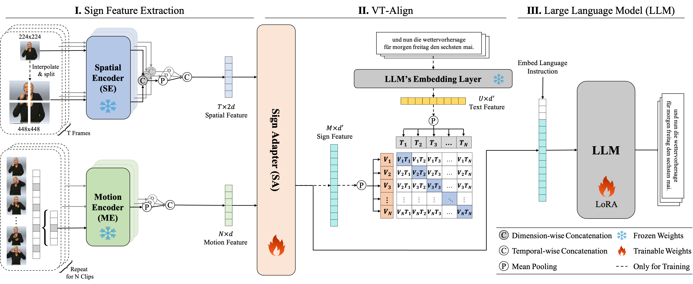

# SpaMo Sign-VLA: Sign Language Translation

This repository is adapted from the original [SpaMo](https://github.com/eddie-euijun-hwang/SpaMo) implementation by Hwang et al., published at NAACL 2025: *[An Efficient Gloss-Free Sign Language Translation Using Spatial Configurations and Motion Dynamics with LLMs](https://aclanthology.org/2025.naacl-long.197.pdf)*.

This fork extends the original codebase with a **real-time translation pipeline** — allowing you to record sign language via webcam and translate it to text using the pre-trained SpaMo model.


## Background



SpaMo (**Spa**tial and **Mo**tion) is a gloss-free sign language translation framework that uses off-the-shelf visual encoders to extract spatial configurations and motion dynamics from sign videos, without requiring domain-specific fine-tuning. Spatial features (body pose, hand shape) and motion features (temporal dynamics) are extracted using two separate encoders, then fused and fed into an LLM with a language prompt to produce translations.


## Architecture Overview

| Component | Model | Purpose |
|--|--|--|
| **Spatial Encoder** | [CLIP ViT-Large-Patch14](https://huggingface.co/openai/clip-vit-large-patch14) | Extracts per-frame spatial features (body pose, hand shape), output dim: 1024 |
| **Motion Encoder** | [VideoMAE-Large](https://huggingface.co/MCG-NJU/videomae-large) | Extracts temporal dynamics across sliding windows of 16 frames, output dim: 1024 |
| **LLM Backbone** | [Flan-T5-XL](https://huggingface.co/google/flan-t5-xl) (~11GB) | Sequence-to-sequence translation with LoRA fine-tuning |
| **SpaMo Adapter** | Custom (temporal conv + fusion MLP) | Fuses spatial & motion features and projects into T5's embedding space |


## Installation

### 1. Clone the repository

```bash
git clone https://github.com/HGardner1108/SpaMo-Sign-VLA.git
cd SpaMo-Sign-VLA
```

### 2. Create a conda environment (recommended)

```bash
conda create -n spamo python=3.10 -y
conda activate spamo
```

### 3. Install PyTorch (with CUDA)

Install PyTorch matching your CUDA version. See [pytorch.org](https://pytorch.org/get-started/locally/) for the right command. For CUDA 11.8:

```bash
pip install torch==2.0.1 torchvision torchaudio --index-url https://download.pytorch.org/whl/cu118
```

### 4. Install dependencies

```bash
pip install -r requirements.txt
```

Additional dependencies for the **translation pipeline**:
```bash
pip install opencv-python
```

### 5. Download the LLM (Flan-T5-XL)

The model auto-downloads from HuggingFace on first run into `./models/`. Alternatively, download manually:

```bash
# Option A: Auto-download (happens when you run training or translation)
# The config uses model_name: google/flan-t5-xl with cache_dir: ./models

# Option B: Manual download via huggingface-cli
pip install huggingface-hub
huggingface-cli download google/flan-t5-xl --local-dir ./models/flan-t5-xl
```

> **Note:** Flan-T5-XL is ~11GB. Ensure you have sufficient disk space and a GPU with at least 16GB VRAM (or use 4-bit quantization via the live demo).

### 6. Download the SpaMo checkpoint

Download the fine-tuned SpaMo How2Sign checkpoint (includes LoRA weights + adapter layers) trained specifically for American Sign Language (ASL) to English translation:

```bash
mkdir -p weights
# Download from Google Drive:
# https://drive.google.com/file/d/1huqKMCsJbc0C2zaUiFffqNaYGHKdksJF/view?usp=sharing
# Save the downloaded file as: weights/spamo_how2sign.ckpt
```


## Data Preparation

We validate our method on three datasets:
- [Phoenix-2014T](https://www-i6.informatik.rwth-aachen.de/~koller/RWTH-PHOENIX-2014-T/) (German Sign Language → German)
- [CSL-Daily](http://home.ustc.edu.cn/~zhouh156/dataset/csl-daily/) (Chinese Sign Language → Chinese)
- [How2Sign](https://how2sign.github.io/) (American Sign Language → English)

### Pre-extracted Features (Recommended)

Download our pre-extracted spatial and motion features from [Dropbox](https://www.dropbox.com/scl/fo/vgbws4cftewpoc6kudoap/AOtWs7adP4AvK0iT7KkWaJk?rlkey=nf3wp64zenqx3t2z695ndzcy7&st=9ydialet&dl=0) and place them under `./features/`:

```
features/
├── spatial/
│   └── clip-vit-large-patch14_feat_Phoenix14T/
│       ├── train/
│       ├── dev/
│       └── test/
└── motion/
    └── mae_feat_Phoenix14T/
        ├── train/
        ├── dev/
        └── test/
```

### Extracting Features Yourself

#### Spatial Features (CLIP ViT-Large)

The CLIP encoder is automatically downloaded from HuggingFace (`openai/clip-vit-large-patch14`) when you run the extraction script. Multi-scale feature extraction is used with `s2wrapping` at scales 1 and 2:

```bash
python scripts/vit_extract_feature.py \
    --anno_root ./preprocess/Phoenix14T \
    --model_name openai/clip-vit-large-patch14 \
    --video_root /PATH/TO/PHOENIX-2014-T-release-v3/PHOENIX-2014-T/ \
    --cache_dir /PATH/TO/CACHE_DIR \
    --save_dir ./features/spatial/clip-vit-large-patch14_feat_Phoenix14T \
    --s2_mode s2wrapping \
    --scales 1 2 \
    --batch_size 32 \
    --device cuda:0
```

#### Motion Features (VideoMAE-Large)

The VideoMAE encoder is automatically downloaded from HuggingFace (`MCG-NJU/videomae-large`). Uses a sliding window of 16 frames with 8-frame overlap:

```bash
python scripts/mae_extract_feature.py \
    --anno_root ./preprocess/Phoenix14T \
    --model_name MCG-NJU/videomae-large \
    --video_root /PATH/TO/PHOENIX-2014-T-release-v3/PHOENIX-2014-T/ \
    --cache_dir /PATH/TO/CACHE_DIR \
    --save_dir ./features/motion/mae_feat_Phoenix14T \
    --overlap_size 8 \
    --batch_size 32 \
    --device cuda:0
```


## Translation Pipeline (ASL-to-English live inference via Webcam)

Translate your own sign language videos cleanly natively to English using the standalone pipeline:

### 1. Record a video

```bash
python Translation_Pipeline/record_webcam.py
# A window will pop up showing your webcam feed.
# Perform your ASL sign sequence.
# Press 'q' to stop recording.
# The video automatically saves to Translation_Pipeline/translation_target/
```

### 2. Run translation

```bash
python Translation_Pipeline/translate_video.py \
    --video_path Translation_Pipeline/translation_target/ \
    --ckpt_path ./weights/spamo_how2sign.ckpt \
    --config_path ./configs/finetune_how2sign.yaml
```

This will:
1. Extract frames from the video (center-cropped to 210×260)
2. Extract spatial features using CLIP ViT-Large (auto-downloaded)
3. Extract motion features using VideoMAE-Large (auto-downloaded)
4. Load the ASL SpaMo adapter
5. Feed the fused spatial and motion tokens into the T5 Encoder
6. Directly print the final English transcription string!


## Project Structure

```
SpaMo/
├── configs/
│   └── finetune.yaml          # Training & model configuration
├── dataset/
│   ├── datamodule.py          # PyTorch Lightning data module
│   └── p14t.py                # Phoenix-2014T dataset loader
├── features/                  # Pre-extracted visual features (not in git)
├── models/                    # Cached LLM weights (not in git)
├── weights/                   # SpaMo checkpoints (not in git)
├── preprocess/                # Dataset annotation files
├── scripts/
│   ├── vit_extract_feature.py # CLIP spatial feature extraction
│   └── mae_extract_feature.py # VideoMAE motion feature extraction
├── spamo/
│   ├── t5_slt.py              # Main SpaMo model (FlanT5SLT)
│   ├── tconv.py               # Temporal convolution encoder
│   ├── mm_projector.py        # Vision-language projection layers
│   └── ...
├── Translation_Pipeline/
│   ├── translate_video.py     # End-to-end video translation
│   └── record_webcam.py       # Webcam video recorder
├── utils/
│   ├── helpers.py             # Utility functions
│   ├── s2wrapper.py           # Multi-scale ViT wrapper
│   └── evaluate.py            # BLEU/ROUGE evaluation
└── main.py                    # Training & evaluation entry point
```


## Hardware Requirements

| Task | GPU VRAM | Disk Space |
|--|--|--|
| Evaluation / Translation | ≥16 GB | ~17 GB (model + checkpoint) |


## Citation

This work is built on SpaMo. If you use this repository, please cite the original paper:

```bibtex
@inproceedings{hwang2025efficient,
  title={An Efficient Sign Language Translation Using Spatial Configuration and Motion Dynamics with LLMs},
  author={Hwang, Eui Jun and Cho, Sukmin and Lee, Junmyeong and Park, Jong C},
  booktitle={NAACL},
  year={2025}
}
```
